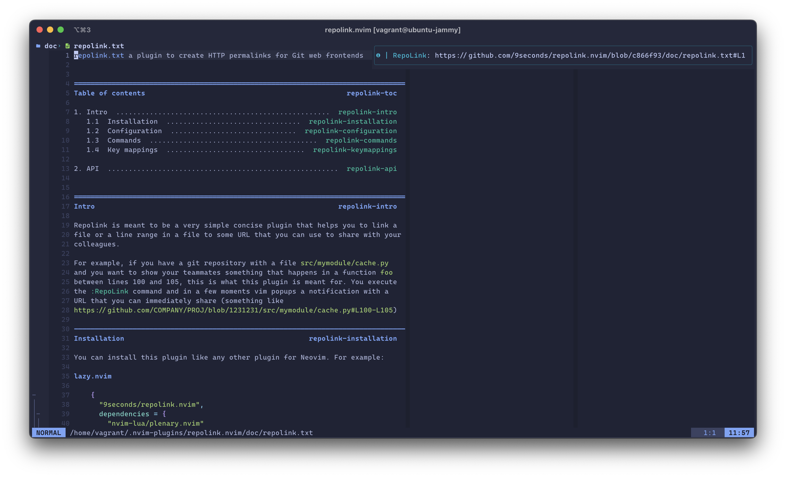

# repolink.nvim

Repolink is meant to be a very simple plugin for Neovim, that helps you to link
a file or a line range in a file to some URL that you can use to share with
your colleagues.

For example, if you have a git repository with a file `src/mymodule/cache.py`
and you want to show your teammates something that happens in a function `foo`
between lines 100 and 105, this is what this plugin is meant for. You execute
the `:RepoLink` command and in a few moments vim popups a notification with a
URL that you can immediately share (something like
`https://github.com/COMPANY/PROJ/blob/1231231/src/mymodule/cache.py#L100-L105`)



## Installation

### [lazy.nvim](https://github.com/folke/lazy.nvim)

```lua
{
  "9seconds/repolink.nvim",
  dependencies = {
    "nvim-lua/plenary.nvim"
  },
  cmd = {
    "RepoLink"
  },

  opts = {
    -- your configuration goes here.
    -- keep empty object if you are fine with defaults
  },
}
```

### [packer.nvim](https://github.com/wbthomason/packer.nvim)

```lua
use {
  "9seconds/repolink.nvim",
  requires = {
    "nvim-lua/plenary.nvim"
  },
  opt = true,
  cmd = {
    "RepoLink"
  },

  config = function()
    require("repolink").setup({
      -- your configuration goes here.
      -- keep empty object if you are fine with defaults
    })
  end
}
```

## Configuration

Here is default config:

```lua
{
  -- By default, repolink tries to create links with short commits
  -- like, 42dd21c instead of 42dd21cf54779c9175c4ff7450d91a9ad0387491
  -- If you like to have full commits, please enable this flag
  use_full_commit_hash = false,

  -- repolink takes remote URLs from git itself and can parse
  -- most common ones: from Github, Bitbucket, Sourcehut, Gitlab, Gitea, etc.
  -- but sometimes you can have a quite weird configuration, made with,
  -- for example, cgit, so the default one won't work for you.
  --
  -- If you provide this custom parser, it should be a function that
  -- parses a remote URL and returns a hostname and some data blob
  -- that could be used later, on URL building.
  --
  -- host parameter would be used to find out a function that is used
  -- to convert remote URL and repository data to an HTTP permalink
  --
  -- data parameter can be anything but you want to use the default URL
  -- builders, it should be a table of
  -- { user = "YOUR USER", project = "PROJECT NAME" }
  --
  -- Example of parser for git@github.com:9seconds/repolink.nvim.git URL:
  --
  --     function(remote_url)
  --         local host, user, project = string.match(
  --             remote_url,
  --             "^git@([^:]+):([^/]+)/(.+)%.git$")
  --         if host then
  --           return host, {
  --             user = user,
  --             project = project
  --           }
  --         end
  --     end
  custom_url_parser = nil,

  -- repolink runs Git. Usually, it finishes quite fast but if you have a
  -- slow storage, like NFS, can take some time. This is a timeout
  -- after which repolink fails.
  timeout = 5000,

  -- a table of builders that maps a hostname to a function that builds URL.
  -- an example of such function (builder for GitHub):
  --
  --     function(args)
  --       local anchor = "L" .. tostring(args.start_line)
  --       if args.start_line ~= args.end_line then
  --         anchor = anchor .. "-L" .. tostring(args.end_line)
  --       end
  --
  --       return string.format(
  --         "https://github.com/%s/%s/blob/%s/%s#%s",
  --         args.host_data.user,
  --         args.host_data.project,
  --         args.commit_hash,
  --         args.path,
  --         anchor
  --       )
  --
  -- args is a table:
  --
  --    {
  --      start_line = 1
  --      end_line = 2,
  --      host = "github.com",
  --      host_data = {
  --        user = "9seconds",
  --        project = "repolink.nvim"
  --      },
  --      commit_hash = "42dd21c",
  --      path = "doc/repolink.txt",
  --    }
  url_builders = {
    ["github.com"] = require("repolink").url_builder_for_github("https://github.com"),
    ["bitbucket.org"] = require("repolink").url_builder_for_bitbucket("https://bitbucket.org"),
    ["gitlab.com"] = require("repolink").url_builder_for_gitlab("https://gitlab.com"),
    ["git.sr.ht"] = require("repolink").url_builder_for_sourcehut("https://git.sr.ht"),
  },
}
```

For example, if you want to use long commit hashes, then use

```lua
require("repolink").setup({
  use_full_commit_hash = true,
})
```

## Usage

Repolink does not provide any custom key mapping, it just have a Lua API and
a single command `:RepoLink`. This command works for both normal and visual modes:

A result is delivered with
`vim.notify()` so you can either check `:messages` or see a fancy notification
from [nvim-notify](https://github.com/rcarriga/nvim-notify).

Sometimes you do not want to have a link to a certain commit. In that case
you can do

```vim
:RepoLink master
```

This will assume that the commit has is `master`. It won't check anything, just
trust. If you want to specify a certain remote, then do

```vim
:RepoLink master notorigin
```

If you still want to use autodetection, use `.` (dot).

```vim
:RepoLink .
:RepoLink . notorigin
```

If you still want to have it mapped to some keys, then it is also possible.
Please do

```vim
nnoremap <leader>rl <cmd>RepoLink<cr>
vnoremap <leader>r  <cmd>RepoLink<cr>
```

or with Lua:

```lua
vim.keymap.set(
  {"n", "v"},
  "<leader>rl",
  "<cmd>RepoLink<cr>",
  { desc = "Generate HTTP permalink" })
```
